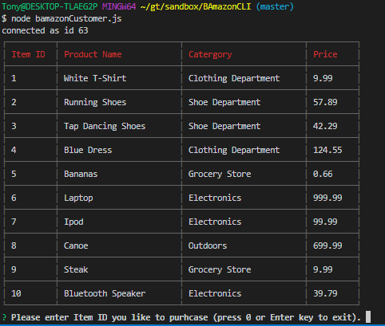
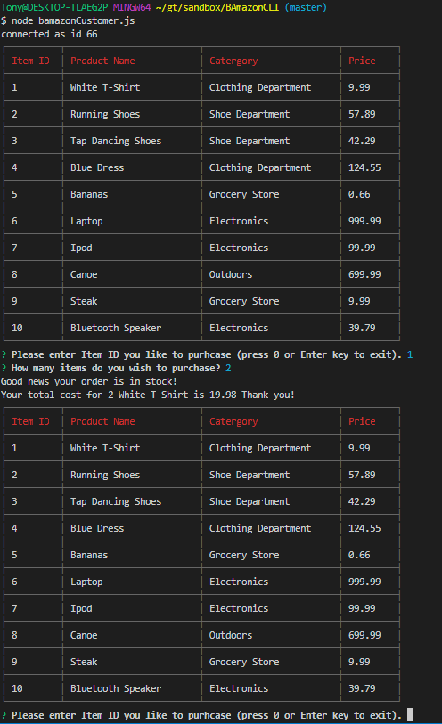
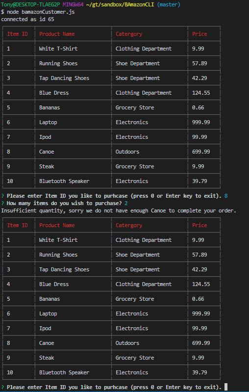
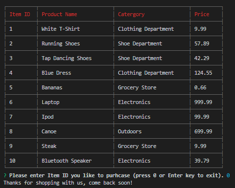

# BAmazonCLI

### Overview

BAmazon is a Amazon "like" CLI-based storefront using a MySQL database backend.

### Technologies

* Javascript
* Node.js
* MySQL
* Inquirer
* CLI-Table

### Instructions On How To Run The App

1. Clone the repository

    * Make sure you are in the correct directory 

2. Run npm install, and the following packages should be installed:

    * mysql
    * inquirer
    * cli-table

3. Run the bamazon.sql in MySQL Workbench to create the database with appropriate table.

    * At this point make sure your port and password are correct in the bamazonCustomer.js file.

4. Command to run file: node bamazonCustomer.js

### Examples of the app working

Here is an example of running node bamazonCustomer.js.

Here is an example of purchasing an item.

Here is an example of an insufficient quantity of an item.

Here is an example exiting the store.

